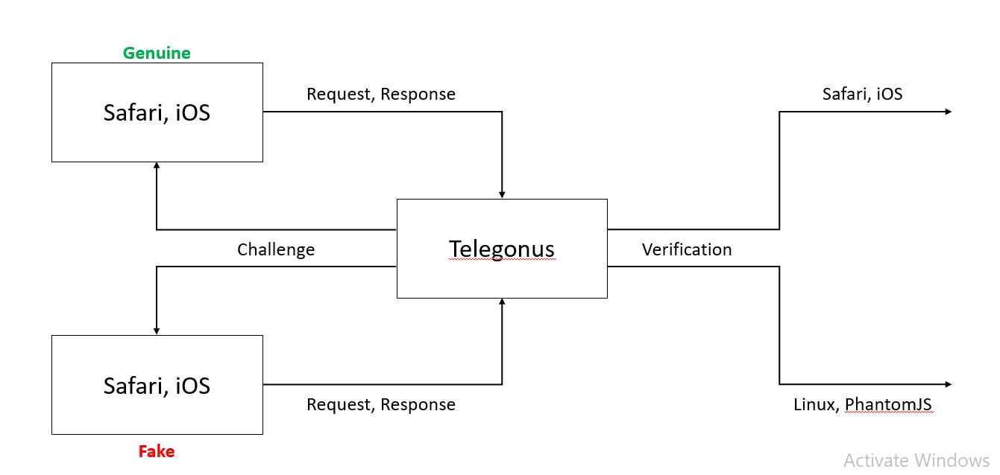
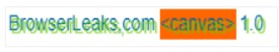
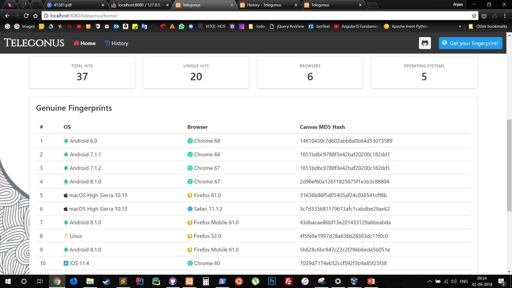

# Telegonus
It is web service which will detect unique system using user agent of the
system and we find any fake user agent which is not available in side our
database we will show him unsolvable captcha.

<h1>User Agent</h1>

<h2>1)A Normal User Agent</h2> 
Mozilla/5.0 (Windows NT 10.0; Win64; x64) AppleWebKit/537.36 (KHTML, like Gecko) Chrome/68.0.3440.106 Safari/537.36
 
<h2>2)Googlebot’s User Agent</h2> 
Googlebot-Image/1.0
 
<h1>Canvas Fingerprinting</h1>

The solution to verify the authenticity of a received User Agent

 
<h1>Basic Scenario</h1>
 

 
<h1>A sample canvas</h1> -
The below given image is an example of the canvas which the server requests the browser to draw.
 

 

<h1>Canvas differences</h1>
Some 35 different canvases are collated below to show how they change from browser to browser and OS to OS.
 
 

<h1>Genuine Fingerprints</h1> 
 

# Telegonus
It is web service which will detect unique system using user agent of the
system and we find any fake user agent which is not available in side our
database we will show him unsolvable captcha.

<h1>User Agent</h1>

<h2>1)A Normal User Agent</h2> 
Mozilla/5.0 (Windows NT 10.0; Win64; x64) AppleWebKit/537.36 (KHTML, like Gecko) Chrome/68.0.3440.106 Safari/537.36
 
<h2>2)Googlebot’s User Agent</h2> 
Googlebot-Image/1.0
 
<h1>Canvas Fingerprinting</h1>

The solution to verify the authenticity of a received User Agent

 
<h1>Basic Scenario</h1>
 

 
<h1>A sample canvas</h1> -
The below given image is an example of the canvas which the server requests the browser to draw.
 

 

<h1>Canvas differences</h1>
Some 35 different canvases are collated below to show how they change from browser to browser and OS to OS.
 
 

<h1>Genuine Fingerprints</h1> 
 

# Telegonus
It is web service which will detect unique system using user agent of the
system and we find any fake user agent which is not available in side our
database we will show him unsolvable captcha.

<h1>User Agent</h1>

<h2>1)A Normal User Agent</h2> 
Mozilla/5.0 (Windows NT 10.0; Win64; x64) AppleWebKit/537.36 (KHTML, like Gecko) Chrome/68.0.3440.106 Safari/537.36
 
<h2>2)Googlebot’s User Agent</h2> 
Googlebot-Image/1.0
 
<h1>Canvas Fingerprinting</h1>

The solution to verify the authenticity of a received User Agent

 
<h1>Basic Scenario</h1>
 

 
<h1>A sample canvas</h1> -
The below given image is an example of the canvas which the server requests the browser to draw.
 

 

<h1>Canvas differences</h1>
Some 35 different canvases are collated below to show how they change from browser to browser and OS to OS.
 
 

<h1>Genuine Fingerprints</h1> 
 

# Telegonus
It is web service which will detect unique system using user agent of the
system and we find any fake user agent which is not available in side our
database we will show him unsolvable captcha.

<h1>User Agent</h1>

<h2>1)A Normal User Agent</h2> 
Mozilla/5.0 (Windows NT 10.0; Win64; x64) AppleWebKit/537.36 (KHTML, like Gecko) Chrome/68.0.3440.106 Safari/537.36
 
<h2>2)Googlebot’s User Agent</h2> 
Googlebot-Image/1.0
 
<h1>Canvas Fingerprinting</h1>

The solution to verify the authenticity of a received User Agent

 
<h1>Basic Scenario</h1>
 

 
<h1>A sample canvas</h1> -
The below given image is an example of the canvas which the server requests the browser to draw.
 

 

<h1>Canvas differences</h1>
Some 35 different canvases are collated below to show how they change from browser to browser and OS to OS.
 
 

<h1>Genuine Fingerprints</h1> 
 

# Telegonus
It is web service which will detect unique system using user agent of the
system and we find any fake user agent which is not available in side our
database we will show him unsolvable captcha.

<h1>User Agent</h1>

<h2>1)A Normal User Agent</h2> 
Mozilla/5.0 (Windows NT 10.0; Win64; x64) AppleWebKit/537.36 (KHTML, like Gecko) Chrome/68.0.3440.106 Safari/537.36
 
<h2>2)Googlebot’s User Agent</h2> 
Googlebot-Image/1.0
 
<h1>Canvas Fingerprinting</h1>

The solution to verify the authenticity of a received User Agent

 
<h1>Basic Scenario</h1>
 

 
<h1>A sample canvas</h1> -
The below given image is an example of the canvas which the server requests the browser to draw.
 

 

<h1>Canvas differences</h1>
Some 35 different canvases are collated below to show how they change from browser to browser and OS to OS.
 
 

<h1>Genuine Fingerprints</h1> 
 

# Telegonus
It is web service which will detect unique system using user agent of the
system and we find any fake user agent which is not available in side our
database we will show him unsolvable captcha.

<h1>User Agent</h1>

<h2>1)A Normal User Agent</h2> 
Mozilla/5.0 (Windows NT 10.0; Win64; x64) AppleWebKit/537.36 (KHTML, like Gecko) Chrome/68.0.3440.106 Safari/537.36
 
<h2>2)Googlebot’s User Agent</h2> 
Googlebot-Image/1.0
 
<h1>Canvas Fingerprinting</h1>

The solution to verify the authenticity of a received User Agent

 
<h1>Basic Scenario</h1>
 

 
<h1>A sample canvas</h1> -
The below given image is an example of the canvas which the server requests the browser to draw.
 

 

<h1>Canvas differences</h1>
Some 35 different canvases are collated below to show how they change from browser to browser and OS to OS.
 
 

<h1>Genuine Fingerprints</h1> 
 

# Telegonus
It is web service which will detect unique system using user agent of the
system and we find any fake user agent which is not available in side our
database we will show him unsolvable captcha.

<h1>User Agent</h1>

<h2>1)A Normal User Agent</h2> 
Mozilla/5.0 (Windows NT 10.0; Win64; x64) AppleWebKit/537.36 (KHTML, like Gecko) Chrome/68.0.3440.106 Safari/537.36
 
<h2>2)Googlebot’s User Agent</h2> 
Googlebot-Image/1.0
 
<h1>Canvas Fingerprinting</h1>

The solution to verify the authenticity of a received User Agent

 
<h1>Basic Scenario</h1>
 

 
<h1>A sample canvas</h1> -
The below given image is an example of the canvas which the server requests the browser to draw.
 

 

<h1>Canvas differences</h1>
Some 35 different canvases are collated below to show how they change from browser to browser and OS to OS.
 
 

<h1>Genuine Fingerprints</h1> 
 

# Telegonus
It is web service which will detect unique system using user agent of the
system and we find any fake user agent which is not available in side our
database we will show him unsolvable captcha.

<h1>User Agent</h1>

<h2>1)A Normal User Agent</h2> 
Mozilla/5.0 (Windows NT 10.0; Win64; x64) AppleWebKit/537.36 (KHTML, like Gecko) Chrome/68.0.3440.106 Safari/537.36
 
<h2>2)Googlebot’s User Agent</h2> 
Googlebot-Image/1.0
 
<h1>Canvas Fingerprinting</h1>

The solution to verify the authenticity of a received User Agent

 
<h1>Basic Scenario</h1>
 

 
<h1>A sample canvas</h1> -
The below given image is an example of the canvas which the server requests the browser to draw.
 

 

<h1>Canvas differences</h1>
Some 35 different canvases are collated below to show how they change from browser to browser and OS to OS.
 
 

<h1>Genuine Fingerprints</h1> 
 

# Telegonus
It is web service which will detect unique system using user agent of the
system and we find any fake user agent which is not available in side our
database we will show him unsolvable captcha.

<h1>User Agent</h1>

<h2>1)A Normal User Agent</h2> 
Mozilla/5.0 (Windows NT 10.0; Win64; x64) AppleWebKit/537.36 (KHTML, like Gecko) Chrome/68.0.3440.106 Safari/537.36
 
<h2>2)Googlebot’s User Agent</h2> 
Googlebot-Image/1.0
 
<h1>Canvas Fingerprinting</h1>

The solution to verify the authenticity of a received User Agent

 
<h1>Basic Scenario</h1>
 

 
<h1>A sample canvas</h1> -
The below given image is an example of the canvas which the server requests the browser to draw.
 

 

<h1>Canvas differences</h1>
Some 35 different canvases are collated below to show how they change from browser to browser and OS to OS.
 
 

<h1>Genuine Fingerprints</h1> 
 

# Telegonus
It is web service which will detect unique system using user agent of the
system and we find any fake user agent which is not available in side our
database we will show him unsolvable captcha.

<h1>User Agent</h1>

<h2>1)A Normal User Agent</h2> 
Mozilla/5.0 (Windows NT 10.0; Win64; x64) AppleWebKit/537.36 (KHTML, like Gecko) Chrome/68.0.3440.106 Safari/537.36
 
<h2>2)Googlebot’s User Agent</h2> 
Googlebot-Image/1.0
 
<h1>Canvas Fingerprinting</h1>

The solution to verify the authenticity of a received User Agent

 
<h1>Basic Scenario</h1>
 

 
<h1>A sample canvas</h1> -
The below given image is an example of the canvas which the server requests the browser to draw.
 

 

<h1>Canvas differences</h1>
Some 35 different canvases are collated below to show how they change from browser to browser and OS to OS.
 
 

<h1>Genuine Fingerprints</h1> 
 

# Telegonus
It is web service which will detect unique system using user agent of the
system and we find any fake user agent which is not available in side our
database we will show him unsolvable captcha.

<h1>User Agent</h1>

<h2>1)A Normal User Agent</h2> 
Mozilla/5.0 (Windows NT 10.0; Win64; x64) AppleWebKit/537.36 (KHTML, like Gecko) Chrome/68.0.3440.106 Safari/537.36
 
<h2>2)Googlebot’s User Agent</h2> 
Googlebot-Image/1.0
 
<h1>Canvas Fingerprinting</h1>

The solution to verify the authenticity of a received User Agent

 
<h1>Basic Scenario</h1>
 

 
<h1>A sample canvas</h1> -
The below given image is an example of the canvas which the server requests the browser to draw.
 

 

<h1>Canvas differences</h1>
Some 35 different canvases are collated below to show how they change from browser to browser and OS to OS.
 
 

<h1>Genuine Fingerprints</h1> 
 

# Telegonus
It is web service which will detect unique system using user agent of the
system and we find any fake user agent which is not available in side our
database we will show him unsolvable captcha.

<h1>User Agent</h1>

<h2>1)A Normal User Agent</h2> 
Mozilla/5.0 (Windows NT 10.0; Win64; x64) AppleWebKit/537.36 (KHTML, like Gecko) Chrome/68.0.3440.106 Safari/537.36
 
<h2>2)Googlebot’s User Agent</h2> 
Googlebot-Image/1.0
 
<h1>Canvas Fingerprinting</h1>

The solution to verify the authenticity of a received User Agent

 
<h1>Basic Scenario</h1>
 

 
<h1>A sample canvas</h1> -
The below given image is an example of the canvas which the server requests the browser to draw.
 

 

<h1>Canvas differences</h1>
Some 35 different canvases are collated below to show how they change from browser to browser and OS to OS.
 
 

<h1>Genuine Fingerprints</h1> 
 

# Telegonus
It is web service which will detect unique system using user agent of the
system and we find any fake user agent which is not available in side our
database we will show him unsolvable captcha.

<h1>User Agent</h1>

<h2>1)A Normal User Agent</h2> 
Mozilla/5.0 (Windows NT 10.0; Win64; x64) AppleWebKit/537.36 (KHTML, like Gecko) Chrome/68.0.3440.106 Safari/537.36
 
<h2>2)Googlebot’s User Agent</h2> 
Googlebot-Image/1.0
 
<h1>Canvas Fingerprinting</h1>

The solution to verify the authenticity of a received User Agent

 
<h1>Basic Scenario</h1>
 

 
<h1>A sample canvas</h1> -
The below given image is an example of the canvas which the server requests the browser to draw.
 

 

<h1>Canvas differences</h1>
Some 35 different canvases are collated below to show how they change from browser to browser and OS to OS.
 
 

<h1>Genuine Fingerprints</h1> 
 

# Telegonus
It is web service which will detect unique system using user agent of the
system and we find any fake user agent which is not available in side our
database we will show him unsolvable captcha.

<h1>User Agent</h1>

<h2>1)A Normal User Agent</h2> 
Mozilla/5.0 (Windows NT 10.0; Win64; x64) AppleWebKit/537.36 (KHTML, like Gecko) Chrome/68.0.3440.106 Safari/537.36
 
<h2>2)Googlebot’s User Agent</h2> 
Googlebot-Image/1.0
 
<h1>Canvas Fingerprinting</h1>

The solution to verify the authenticity of a received User Agent

 
<h1>Basic Scenario</h1>
 

 
<h1>A sample canvas</h1> -
The below given image is an example of the canvas which the server requests the browser to draw.
 

 

<h1>Canvas differences</h1>
Some 35 different canvases are collated below to show how they change from browser to browser and OS to OS.
 
 

<h1>Genuine Fingerprints</h1> 
 

# Telegonus
It is web service which will detect unique system using user agent of the
system and we find any fake user agent which is not available in side our
database we will show him unsolvable captcha.

<h1>User Agent</h1>

<h2>1)A Normal User Agent</h2> 
Mozilla/5.0 (Windows NT 10.0; Win64; x64) AppleWebKit/537.36 (KHTML, like Gecko) Chrome/68.0.3440.106 Safari/537.36
 
<h2>2)Googlebot’s User Agent</h2> 
Googlebot-Image/1.0
 
<h1>Canvas Fingerprinting</h1>

The solution to verify the authenticity of a received User Agent

 
<h1>Basic Scenario</h1>
 

 
<h1>A sample canvas</h1> -
The below given image is an example of the canvas which the server requests the browser to draw.
 

 

<h1>Canvas differences</h1>
Some 35 different canvases are collated below to show how they change from browser to browser and OS to OS.
 
 

<h1>Genuine Fingerprints</h1> 
 

# Telegonus
It is web service which will detect unique system using user agent of the
system and we find any fake user agent which is not available in side our
database we will show him unsolvable captcha.

<h1>User Agent</h1>

<h2>1)A Normal User Agent</h2> 
Mozilla/5.0 (Windows NT 10.0; Win64; x64) AppleWebKit/537.36 (KHTML, like Gecko) Chrome/68.0.3440.106 Safari/537.36
 
<h2>2)Googlebot’s User Agent</h2> 
Googlebot-Image/1.0
 
<h1>Canvas Fingerprinting</h1>

The solution to verify the authenticity of a received User Agent

 
<h1>Basic Scenario</h1>
 

 
<h1>A sample canvas</h1> -
The below given image is an example of the canvas which the server requests the browser to draw.
 

 

<h1>Canvas differences</h1>
Some 35 different canvases are collated below to show how they change from browser to browser and OS to OS.
 
 

<h1>Genuine Fingerprints</h1> 
 

# Telegonus
It is web service which will detect unique system using user agent of the
system and we find any fake user agent which is not available in side our
database we will show him unsolvable captcha.

<h1>User Agent</h1>

<h2>1)A Normal User Agent</h2> 
Mozilla/5.0 (Windows NT 10.0; Win64; x64) AppleWebKit/537.36 (KHTML, like Gecko) Chrome/68.0.3440.106 Safari/537.36
 
<h2>2)Googlebot’s User Agent</h2> 
Googlebot-Image/1.0
 
<h1>Canvas Fingerprinting</h1>

The solution to verify the authenticity of a received User Agent

 
<h1>Basic Scenario</h1>
 

 
<h1>A sample canvas</h1> -
The below given image is an example of the canvas which the server requests the browser to draw.
 

 

<h1>Canvas differences</h1>
Some 35 different canvases are collated below to show how they change from browser to browser and OS to OS.
 
 

<h1>Genuine Fingerprints</h1> 
 

# Telegonus
It is web service which will detect unique system using user agent of the
system and we find any fake user agent which is not available in side our
database we will show him unsolvable captcha.

<h1>User Agent</h1>

<h2>1)A Normal User Agent</h2> 
Mozilla/5.0 (Windows NT 10.0; Win64; x64) AppleWebKit/537.36 (KHTML, like Gecko) Chrome/68.0.3440.106 Safari/537.36
 
<h2>2)Googlebot’s User Agent</h2> 
Googlebot-Image/1.0
 
<h1>Canvas Fingerprinting</h1>

The solution to verify the authenticity of a received User Agent

 
<h1>Basic Scenario</h1>
 

 
<h1>A sample canvas</h1> -
The below given image is an example of the canvas which the server requests the browser to draw.
 

 

<h1>Canvas differences</h1>
Some 35 different canvases are collated below to show how they change from browser to browser and OS to OS.
 
 

<h1>Genuine Fingerprints</h1> 
 

# Telegonus
It is web service which will detect unique system using user agent of the
system and we find any fake user agent which is not available in side our
database we will show him unsolvable captcha.

<h1>User Agent</h1>

<h2>1)A Normal User Agent</h2> 
Mozilla/5.0 (Windows NT 10.0; Win64; x64) AppleWebKit/537.36 (KHTML, like Gecko) Chrome/68.0.3440.106 Safari/537.36
 
<h2>2)Googlebot’s User Agent</h2> 
Googlebot-Image/1.0
 
<h1>Canvas Fingerprinting</h1>

The solution to verify the authenticity of a received User Agent

 
<h1>Basic Scenario</h1>
 

 
<h1>A sample canvas</h1> -
The below given image is an example of the canvas which the server requests the browser to draw.
 

 

<h1>Canvas differences</h1>
Some 35 different canvases are collated below to show how they change from browser to browser and OS to OS.
 
 

<h1>Genuine Fingerprints</h1> 
 

# Telegonus
It is web service which will detect unique system using user agent of the
system and we find any fake user agent which is not available in side our
database we will show him unsolvable captcha.

<h1>User Agent</h1>

<h2>1)A Normal User Agent</h2> 
Mozilla/5.0 (Windows NT 10.0; Win64; x64) AppleWebKit/537.36 (KHTML, like Gecko) Chrome/68.0.3440.106 Safari/537.36
 
<h2>2)Googlebot’s User Agent</h2> 
Googlebot-Image/1.0
 
<h1>Canvas Fingerprinting</h1>

The solution to verify the authenticity of a received User Agent

 
<h1>Basic Scenario</h1>
 

 
<h1>A sample canvas</h1> -
The below given image is an example of the canvas which the server requests the browser to draw.
 

 

<h1>Canvas differences</h1>
Some 35 different canvases are collated below to show how they change from browser to browser and OS to OS.
 
 

<h1>Genuine Fingerprints</h1> 
 

# Telegonus
It is web service which will detect unique system using user agent of the
system and we find any fake user agent which is not available in side our
database we will show him unsolvable captcha.

<h1>User Agent</h1>

<h2>1)A Normal User Agent</h2> 
Mozilla/5.0 (Windows NT 10.0; Win64; x64) AppleWebKit/537.36 (KHTML, like Gecko) Chrome/68.0.3440.106 Safari/537.36
 
<h2>2)Googlebot’s User Agent</h2> 
Googlebot-Image/1.0
 
<h1>Canvas Fingerprinting</h1>

The solution to verify the authenticity of a received User Agent

 
<h1>Basic Scenario</h1>
 

 
<h1>A sample canvas</h1> -
The below given image is an example of the canvas which the server requests the browser to draw.
 

 

<h1>Canvas differences</h1>
Some 35 different canvases are collated below to show how they change from browser to browser and OS to OS.
 
 

<h1>Genuine Fingerprints</h1> 
 

# Telegonus
It is web service which will detect unique system using user agent of the
system and we find any fake user agent which is not available in side our
database we will show him unsolvable captcha.

<h1>User Agent</h1>

<h2>1)A Normal User Agent</h2> 
Mozilla/5.0 (Windows NT 10.0; Win64; x64) AppleWebKit/537.36 (KHTML, like Gecko) Chrome/68.0.3440.106 Safari/537.36
 
<h2>2)Googlebot’s User Agent</h2> 
Googlebot-Image/1.0
 
<h1>Canvas Fingerprinting</h1>

The solution to verify the authenticity of a received User Agent

 
<h1>Basic Scenario</h1>
 

 
<h1>A sample canvas</h1> -
The below given image is an example of the canvas which the server requests the browser to draw.
 

 

<h1>Canvas differences</h1>
Some 35 different canvases are collated below to show how they change from browser to browser and OS to OS.
 
 

<h1>Genuine Fingerprints</h1> 
 

# Telegonus
It is web service which will detect unique system using user agent of the
system and we find any fake user agent which is not available in side our
database we will show him unsolvable captcha.

<h1>User Agent</h1>

<h2>1)A Normal User Agent</h2> 
Mozilla/5.0 (Windows NT 10.0; Win64; x64) AppleWebKit/537.36 (KHTML, like Gecko) Chrome/68.0.3440.106 Safari/537.36
 
<h2>2)Googlebot’s User Agent</h2> 
Googlebot-Image/1.0
 
<h1>Canvas Fingerprinting</h1>

The solution to verify the authenticity of a received User Agent

 
<h1>Basic Scenario</h1>
 

 
<h1>A sample canvas</h1> -
The below given image is an example of the canvas which the server requests the browser to draw.
 

 

<h1>Canvas differences</h1>
Some 35 different canvases are collated below to show how they change from browser to browser and OS to OS.
 
 

<h1>Genuine Fingerprints</h1> 
 

# Telegonus
It is web service which will detect unique system using user agent of the
system and we find any fake user agent which is not available in side our
database we will show him unsolvable captcha.

<h1>User Agent</h1>

<h2>1)A Normal User Agent</h2> 
Mozilla/5.0 (Windows NT 10.0; Win64; x64) AppleWebKit/537.36 (KHTML, like Gecko) Chrome/68.0.3440.106 Safari/537.36
 
<h2>2)Googlebot’s User Agent</h2> 
Googlebot-Image/1.0
 
<h1>Canvas Fingerprinting</h1>

The solution to verify the authenticity of a received User Agent

 
<h1>Basic Scenario</h1>
 

 
<h1>A sample canvas</h1> -
The below given image is an example of the canvas which the server requests the browser to draw.
 

 

<h1>Canvas differences</h1>
Some 35 different canvases are collated below to show how they change from browser to browser and OS to OS.
 
 

<h1>Genuine Fingerprints</h1> 
 

# Telegonus
It is web service which will detect unique system using user agent of the
system and we find any fake user agent which is not available in side our
database we will show him unsolvable captcha.

<h1>User Agent</h1>

<h2>1)A Normal User Agent</h2> 
Mozilla/5.0 (Windows NT 10.0; Win64; x64) AppleWebKit/537.36 (KHTML, like Gecko) Chrome/68.0.3440.106 Safari/537.36
 
<h2>2)Googlebot’s User Agent</h2> 
Googlebot-Image/1.0
 
<h1>Canvas Fingerprinting</h1>

The solution to verify the authenticity of a received User Agent

 
<h1>Basic Scenario</h1>
 

 
<h1>A sample canvas</h1> -
The below given image is an example of the canvas which the server requests the browser to draw.
 

 

<h1>Canvas differences</h1>
Some 35 different canvases are collated below to show how they change from browser to browser and OS to OS.
 
 

<h1>Genuine Fingerprints</h1> 
 

# Telegonus
It is web service which will detect unique system using user agent of the
system and we find any fake user agent which is not available in side our
database we will show him unsolvable captcha.

<h1>User Agent</h1>

<h2>1)A Normal User Agent</h2> 
Mozilla/5.0 (Windows NT 10.0; Win64; x64) AppleWebKit/537.36 (KHTML, like Gecko) Chrome/68.0.3440.106 Safari/537.36
 
<h2>2)Googlebot’s User Agent</h2> 
Googlebot-Image/1.0
 
<h1>Canvas Fingerprinting</h1>

The solution to verify the authenticity of a received User Agent

 
<h1>Basic Scenario</h1>
 

 
<h1>A sample canvas</h1> -
The below given image is an example of the canvas which the server requests the browser to draw.
 

 

<h1>Canvas differences</h1>
Some 35 different canvases are collated below to show how they change from browser to browser and OS to OS.
 
 

<h1>Genuine Fingerprints</h1> 
 

# Telegonus
It is web service which will detect unique system using user agent of the
system and we find any fake user agent which is not available in side our
database we will show him unsolvable captcha.

<h1>User Agent</h1>

<h2>1)A Normal User Agent</h2> 
Mozilla/5.0 (Windows NT 10.0; Win64; x64) AppleWebKit/537.36 (KHTML, like Gecko) Chrome/68.0.3440.106 Safari/537.36
 
<h2>2)Googlebot’s User Agent</h2> 
Googlebot-Image/1.0
 
<h1>Canvas Fingerprinting</h1>

The solution to verify the authenticity of a received User Agent

 
<h1>Basic Scenario</h1>
 

 
<h1>A sample canvas</h1> -
The below given image is an example of the canvas which the server requests the browser to draw.
 

 

<h1>Canvas differences</h1>
Some 35 different canvases are collated below to show how they change from browser to browser and OS to OS.
 
 

<h1>Genuine Fingerprints</h1> 
 

# Telegonus
It is web service which will detect unique system using user agent of the
system and we find any fake user agent which is not available in side our
database we will show him unsolvable captcha.

<h1>User Agent</h1>

<h2>1)A Normal User Agent</h2> 
Mozilla/5.0 (Windows NT 10.0; Win64; x64) AppleWebKit/537.36 (KHTML, like Gecko) Chrome/68.0.3440.106 Safari/537.36
 
<h2>2)Googlebot’s User Agent</h2> 
Googlebot-Image/1.0
 
<h1>Canvas Fingerprinting</h1>

The solution to verify the authenticity of a received User Agent

 
<h1>Basic Scenario</h1>
 

 
<h1>A sample canvas</h1> -
The below given image is an example of the canvas which the server requests the browser to draw.
 

 

<h1>Canvas differences</h1>
Some 35 different canvases are collated below to show how they change from browser to browser and OS to OS.
 
 

<h1>Genuine Fingerprints</h1> 
 

# Telegonus
It is web service which will detect unique system using user agent of the
system and we find any fake user agent which is not available in side our
database we will show him unsolvable captcha.

<h1>User Agent</h1>

<h2>1)A Normal User Agent</h2> 
Mozilla/5.0 (Windows NT 10.0; Win64; x64) AppleWebKit/537.36 (KHTML, like Gecko) Chrome/68.0.3440.106 Safari/537.36
 
<h2>2)Googlebot’s User Agent</h2> 
Googlebot-Image/1.0
 
<h1>Canvas Fingerprinting</h1>

The solution to verify the authenticity of a received User Agent

 
<h1>Basic Scenario</h1>
 

 
<h1>A sample canvas</h1> -
The below given image is an example of the canvas which the server requests the browser to draw.
 

 

<h1>Canvas differences</h1>
Some 35 different canvases are collated below to show how they change from browser to browser and OS to OS.
 
 

<h1>Genuine Fingerprints</h1> 
 

# Telegonus
It is web service which will detect unique system using user agent of the
system and we find any fake user agent which is not available in side our
database we will show him unsolvable captcha.

<h1>User Agent</h1>

<h2>1)A Normal User Agent</h2> 
Mozilla/5.0 (Windows NT 10.0; Win64; x64) AppleWebKit/537.36 (KHTML, like Gecko) Chrome/68.0.3440.106 Safari/537.36
 
<h2>2)Googlebot’s User Agent</h2> 
Googlebot-Image/1.0
 
<h1>Canvas Fingerprinting</h1>

The solution to verify the authenticity of a received User Agent

 
<h1>Basic Scenario</h1>
 

 
<h1>A sample canvas</h1> -
The below given image is an example of the canvas which the server requests the browser to draw.
 

 

<h1>Canvas differences</h1>
Some 35 different canvases are collated below to show how they change from browser to browser and OS to OS.
 
 

<h1>Genuine Fingerprints</h1> 
 

# Telegonus
It is web service which will detect unique system using user agent of the
system and we find any fake user agent which is not available in side our
database we will show him unsolvable captcha.

<h1>User Agent</h1>

<h2>1)A Normal User Agent</h2> 
Mozilla/5.0 (Windows NT 10.0; Win64; x64) AppleWebKit/537.36 (KHTML, like Gecko) Chrome/68.0.3440.106 Safari/537.36
 
<h2>2)Googlebot’s User Agent</h2> 
Googlebot-Image/1.0
 
<h1>Canvas Fingerprinting</h1>

The solution to verify the authenticity of a received User Agent

 
<h1>Basic Scenario</h1>
 

 
<h1>A sample canvas</h1> -
The below given image is an example of the canvas which the server requests the browser to draw.
 

 

<h1>Canvas differences</h1>
Some 35 different canvases are collated below to show how they change from browser to browser and OS to OS.
 
 

<h1>Genuine Fingerprints</h1> 
 

# Telegonus
It is web service which will detect unique system using user agent of the
system and we find any fake user agent which is not available in side our
database we will show him unsolvable captcha.

<h1>User Agent</h1>

<h2>1)A Normal User Agent</h2> 
Mozilla/5.0 (Windows NT 10.0; Win64; x64) AppleWebKit/537.36 (KHTML, like Gecko) Chrome/68.0.3440.106 Safari/537.36
 
<h2>2)Googlebot’s User Agent</h2> 
Googlebot-Image/1.0
 
<h1>Canvas Fingerprinting</h1>

The solution to verify the authenticity of a received User Agent

 
<h1>Basic Scenario</h1>
 

 
<h1>A sample canvas</h1> -
The below given image is an example of the canvas which the server requests the browser to draw.
 

 

<h1>Canvas differences</h1>
Some 35 different canvases are collated below to show how they change from browser to browser and OS to OS.
 
 

<h1>Genuine Fingerprints</h1> 
 

# Telegonus
It is web service which will detect unique system using user agent of the
system and we find any fake user agent which is not available in side our
database we will show him unsolvable captcha.

<h1>User Agent</h1>

<h2>1)A Normal User Agent</h2> 
Mozilla/5.0 (Windows NT 10.0; Win64; x64) AppleWebKit/537.36 (KHTML, like Gecko) Chrome/68.0.3440.106 Safari/537.36
 
<h2>2)Googlebot’s User Agent</h2> 
Googlebot-Image/1.0
 
<h1>Canvas Fingerprinting</h1>

The solution to verify the authenticity of a received User Agent

 
<h1>Basic Scenario</h1>
 

 
<h1>A sample canvas</h1> -
The below given image is an example of the canvas which the server requests the browser to draw.
 

 

<h1>Canvas differences</h1>
Some 35 different canvases are collated below to show how they change from browser to browser and OS to OS.
 
 

<h1>Genuine Fingerprints</h1> 
 

# Telegonus
It is web service which will detect unique system using user agent of the
system and we find any fake user agent which is not available in side our
database we will show him unsolvable captcha.

<h1>User Agent</h1>

<h2>1)A Normal User Agent</h2> 
Mozilla/5.0 (Windows NT 10.0; Win64; x64) AppleWebKit/537.36 (KHTML, like Gecko) Chrome/68.0.3440.106 Safari/537.36
 
<h2>2)Googlebot’s User Agent</h2> 
Googlebot-Image/1.0
 
<h1>Canvas Fingerprinting</h1>

The solution to verify the authenticity of a received User Agent

 
<h1>Basic Scenario</h1>
 

 
<h1>A sample canvas</h1> -
The below given image is an example of the canvas which the server requests the browser to draw.
 

 

<h1>Canvas differences</h1>
Some 35 different canvases are collated below to show how they change from browser to browser and OS to OS.
 
 

<h1>Genuine Fingerprints</h1> 
 

# Telegonus
It is web service which will detect unique system using user agent of the
system and we find any fake user agent which is not available in side our
database we will show him unsolvable captcha.

<h1>User Agent</h1>

<h2>1)A Normal User Agent</h2> 
Mozilla/5.0 (Windows NT 10.0; Win64; x64) AppleWebKit/537.36 (KHTML, like Gecko) Chrome/68.0.3440.106 Safari/537.36
 
<h2>2)Googlebot’s User Agent</h2> 
Googlebot-Image/1.0
 
<h1>Canvas Fingerprinting</h1>

The solution to verify the authenticity of a received User Agent

 
<h1>Basic Scenario</h1>
 

 
<h1>A sample canvas</h1> -
The below given image is an example of the canvas which the server requests the browser to draw.
 

 

<h1>Canvas differences</h1>
Some 35 different canvases are collated below to show how they change from browser to browser and OS to OS.
 
 

<h1>Genuine Fingerprints</h1> 
 

# Telegonus
It is web service which will detect unique system using user agent of the
system and we find any fake user agent which is not available in side our
database we will show him unsolvable captcha.

<h1>User Agent</h1>

<h2>1)A Normal User Agent</h2> 
Mozilla/5.0 (Windows NT 10.0; Win64; x64) AppleWebKit/537.36 (KHTML, like Gecko) Chrome/68.0.3440.106 Safari/537.36
 
<h2>2)Googlebot’s User Agent</h2> 
Googlebot-Image/1.0
 
<h1>Canvas Fingerprinting</h1>

The solution to verify the authenticity of a received User Agent

 
<h1>Basic Scenario</h1>
 

 
<h1>A sample canvas</h1> -
The below given image is an example of the canvas which the server requests the browser to draw.
 

 

<h1>Canvas differences</h1>
Some 35 different canvases are collated below to show how they change from browser to browser and OS to OS.
 
 

<h1>Genuine Fingerprints</h1> 
 

# Telegonus
It is web service which will detect unique system using user agent of the
system and we find any fake user agent which is not available in side our
database we will show him unsolvable captcha.

<h1>User Agent</h1>

<h2>1)A Normal User Agent</h2> 
Mozilla/5.0 (Windows NT 10.0; Win64; x64) AppleWebKit/537.36 (KHTML, like Gecko) Chrome/68.0.3440.106 Safari/537.36
 
<h2>2)Googlebot’s User Agent</h2> 
Googlebot-Image/1.0
 
<h1>Canvas Fingerprinting</h1>

The solution to verify the authenticity of a received User Agent

 
<h1>Basic Scenario</h1>
 

 
<h1>A sample canvas</h1> -
The below given image is an example of the canvas which the server requests the browser to draw.
 

 

<h1>Canvas differences</h1>
Some 35 different canvases are collated below to show how they change from browser to browser and OS to OS.
 
 

<h1>Genuine Fingerprints</h1> 
 

# Telegonus
It is web service which will detect unique system using user agent of the
system and we find any fake user agent which is not available in side our
database we will show him unsolvable captcha.

<h1>User Agent</h1>

<h2>1)A Normal User Agent</h2> 
Mozilla/5.0 (Windows NT 10.0; Win64; x64) AppleWebKit/537.36 (KHTML, like Gecko) Chrome/68.0.3440.106 Safari/537.36
 
<h2>2)Googlebot’s User Agent</h2> 
Googlebot-Image/1.0
 
<h1>Canvas Fingerprinting</h1>

The solution to verify the authenticity of a received User Agent

 
<h1>Basic Scenario</h1>
 

 
<h1>A sample canvas</h1> -
The below given image is an example of the canvas which the server requests the browser to draw.
 

 

<h1>Canvas differences</h1>
Some 35 different canvases are collated below to show how they change from browser to browser and OS to OS.
 
 

<h1>Genuine Fingerprints</h1> 
 

# Telegonus
It is web service which will detect unique system using user agent of the
system and we find any fake user agent which is not available in side our
database we will show him unsolvable captcha.

<h1>User Agent</h1>

<h2>1)A Normal User Agent</h2> 
Mozilla/5.0 (Windows NT 10.0; Win64; x64) AppleWebKit/537.36 (KHTML, like Gecko) Chrome/68.0.3440.106 Safari/537.36
 
<h2>2)Googlebot’s User Agent</h2> 
Googlebot-Image/1.0
 
<h1>Canvas Fingerprinting</h1>

The solution to verify the authenticity of a received User Agent

 
<h1>Basic Scenario</h1>
 

 
<h1>A sample canvas</h1> -
The below given image is an example of the canvas which the server requests the browser to draw.
 

 

<h1>Canvas differences</h1>
Some 35 different canvases are collated below to show how they change from browser to browser and OS to OS.
 
 

<h1>Genuine Fingerprints</h1> 
 

